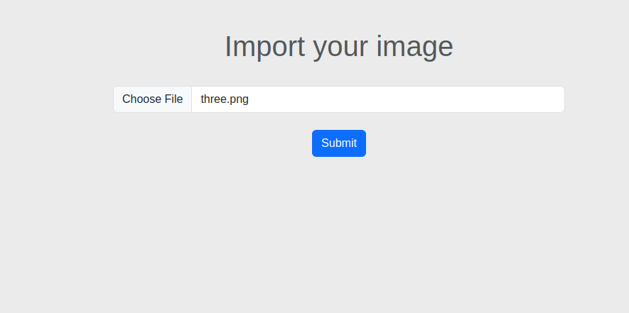
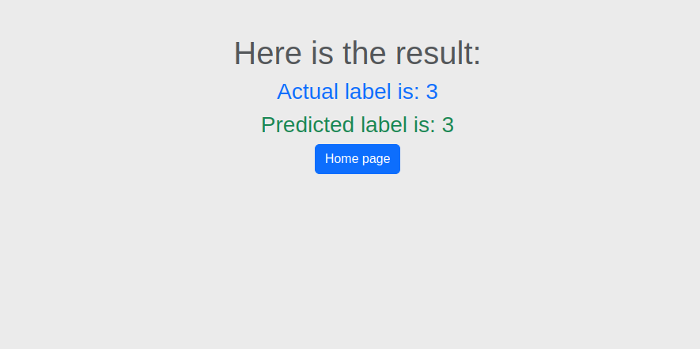

# Flask Project
Here I introduce a Flask project includes a trained model on Mnist dataset. First of all I train a simple Neural Netwrok on Mnist, then save the model weights. Therefore, I am able to load the model and predict test images.

## Results
<table>
  <tr>
    <td></td>
    <td></td>
  </tr>
</table>

## Run The Project

To run the project, run the following command

```bash
  pip install -r requirements.txt
```
then, you need to train the Neural Netwrok model on Mnist and save the weights
```bash
  python train_model.py
```
then,
```bash
  export FLASK_APP = main.py
```

finally,
```bash
  flask run
```
you are able to run the server on http://127.0.0.1:5000/

